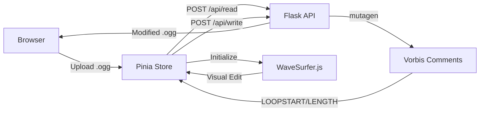

# 🎵 Ogg Loop Editor

<div align="center">


**Browser-based loop metadata editor for .ogg audio files**

[](https://oggloop.vercel.app/)
[](https://nuxt.com/)
[](https://www.python.org/)

[**Live Demo**](https://oggloop.vercel.app/) • [Features](#features) • [Tech Stack](#tech-stack) • [Development](#development)

</div>

---

## Overview

A web-based tool for editing loop metadata in OGG Vorbis audio files. Visualize waveforms, identify precise loop points, and write `LOOPSTART`/`LOOPLENGTH` Vorbis Comments directly into your files—all without leaving your browser.

## Features

- **🎨 Visual Loop Editing** — Drag-and-drop interface with WaveSurfer.js waveform visualization
- **🎯 Sample-Accurate** — Edit loop points at 44.1kHz sample precision
- **⚡ Real-time Preview** — Instant loop playback with adjustable speed (0.2x–2.0x)
- **⌨️ Keyboard Shortcuts** — Vim-inspired controls for efficient workflow
- **💾 Client-Side First** — All processing happens in your browser (serverless functions for metadata only)
- **🎼 Minimap & Timeline** — Navigate long audio files with ease

## Tech Stack

<table>
<tr>
<td>

**Frontend**
- Nuxt 3.14 (SPA mode)
- Vuetify 3.10
- WaveSurfer.js 4.0

</td>
<td>

**Backend**
- Vercel Functions
- Python Flask (serverless)
- mutagen (metadata I/O)

</td>
</tr>
</table>

## Development

### Prerequisites

```bash
node >= 22.0.0
python >= 3.12
```

### Quick Start

```bash
# Install dependencies
npm install

# Set up Python virtual environment
python3 -m venv venv
source venv/bin/activate  # Windows: venv\Scripts\activate
pip install -r requirements.txt

# Start dev server (frontend + backend)
npm run dev
```

The app runs at `localhost:3000` with API server at `localhost:3001`.

### Available Commands

| Command | Description |
|---------|-------------|
| `npm run dev` | Start both frontend and backend |
| `npm run dev:nuxt` | Frontend only (port 3000) |
| `npm run dev:api` | Backend only (port 3001) |
| `npm run build` | Production build |
| `npm run generate` | Static site generation |

## Keyboard Shortcuts

| Key | Action | Key | Action |
|-----|--------|-----|--------|
| <kbd>Space</kbd> | Play/Pause | <kbd>I</kbd> <kbd>O</kbd> <kbd>P</kbd> | Zoom reset/out/in |
| <kbd>←</kbd> <kbd>→</kbd> | Skip 5s | <kbd>Shift</kbd> + <kbd>←</kbd> <kbd>→</kbd> | Skip 10s |
| <kbd>G</kbd> – <kbd>L</kbd> | Speed 0.2x – 2.0x | <kbd>N</kbd> <kbd>M</kbd> | Repeat from loop end -6s/-3s |

## Architecture



### Key Files

- [lib/Surf.js](lib/Surf.js) — WaveSurfer config, sample/time conversion utilities
- [stores/appState.ts](stores/appState.ts) — Pinia store managing app state and business logic
- [api/read/index.py](api/read/index.py) — Metadata extraction endpoint
- [api/write/index.py](api/write/index.py) — Metadata writing endpoint

## License

MIT

---

<div align="center">

**[oggloop.vercel.app](https://oggloop.vercel.app/)**

Made with ♪ for game audio developers

</div>
